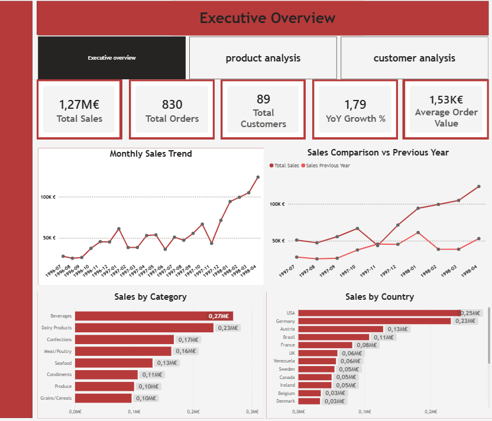
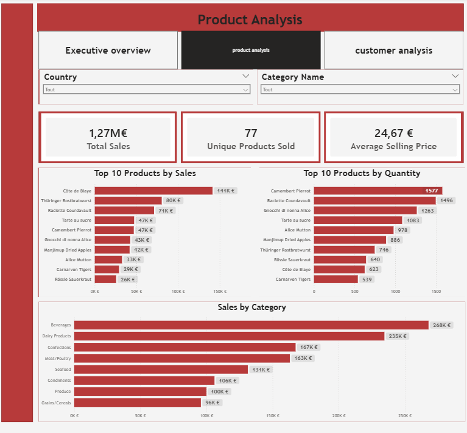
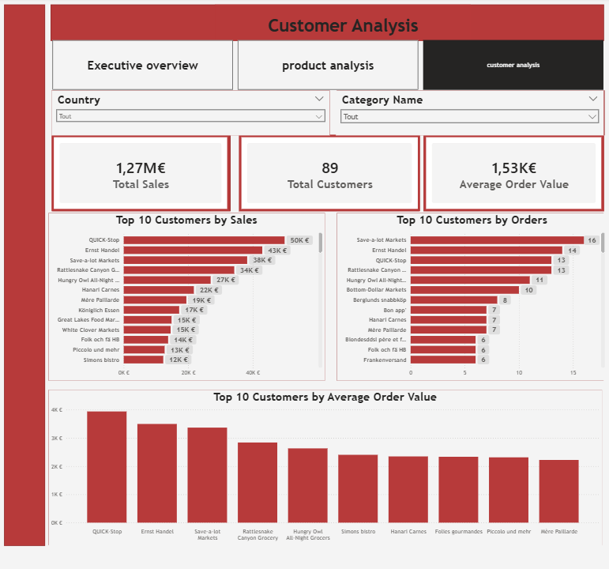

# 📊 Northwind Sales Dashboard

## 📌 Project Overview

This project is a complete Business Intelligence solution built using **SQL Server** and **Power BI**.  
It analyzes sales data from the Northwind database to provide insights into:

- Sales performance  
- Product analysis  
- Customer behavior  

---

## 🛠️ Tools & Technologies

- SQL Server (data preparation & modeling)
- Power BI (data visualization & dashboard)
- DAX (measures & calculations)

---

## 🧱 Data Modeling

A **star schema** was implemented using SQL views:

- `vw_fact_sales`
- `vw_dim_product`
- `vw_dim_customer`
- `vw_dim_employee`
- `vw_dim_date`

This structure improves performance and simplifies analysis in Power BI.

---

## 📊 Dashboard Pages

### 1. Executive Overview
- KPIs: Total Sales, Total Orders, Total Customers, YoY Growth
- Monthly sales trend
- Sales comparison vs previous year
- Sales by category and country

---

### 2. Product Analysis
- Top 10 products by sales
- Top 10 products by quantity
- Sales by category
- Interactive filters (Country, Category)

---

### 3. Customer Analysis
- Top 10 customers by sales
- Top 10 customers by number of orders
- Top 10 customers by average order value
- Customer segmentation insights

---

## 📈 Key Insights

- Some products generate high revenue but low volume  
- High-frequency customers do not always have high spending  
- A small number of customers contribute significantly to total revenue  

---

## 📷 Dashboard Preview

---

## 🚀 How to Use

1. Open the `.pbix` file in Power BI Desktop  
2. Refresh the data if needed  
3. Use slicers to explore the dashboard  

---

## 📁 Repository Structure
